# Database Schema - User Authentication

## Entity Relationship Diagram

```mermaid
erDiagram
    USERS ||--o{ USER_AUTH_IDENTITIES : has
    USERS ||--o{ APPOINTMENTS : books
    USERS ||--o{ LOYALTY_BALANCES : earns
    USERS ||--o{ REVIEWS : writes
    USERS ||--o{ USER_CONSENTS : gives
    USERS ||--o{ SALON_USER_ROLES : has
    USERS ||--o{ STAFF_PROFILES : "has_profile"

    SALONS ||--o{ LOCATIONS : has
    SALONS ||--o{ TREATMENTS : offers
    SALONS ||--o{ LOYALTY_BALANCES : "tracks_points"
    SALONS ||--o{ REVIEWS : receives
    SALONS ||--o{ SALON_USER_ROLES : assigns

    TREATMENT_VARIANTS ||--o{ APPOINTMENTS : scheduled
    TREATMENT_VARIANTS ||--o{ STAFF_TREATMENT_CAPABILITIES : "staff_can_do"
    TREATMENTS ||--o{ TREATMENT_VARIANTS : has
    TREATMENTS ||--o{ TREATMENT_ADDONS : has

    STAFF_PROFILES ||--o{ APPOINTMENTS : works
    STAFF_PROFILES ||--o{ REVIEWS : receives_from
    STAFF_PROFILES ||--o{ STAFF_TREATMENT_CAPABILITIES : has
    STAFF_PROFILES ||--o{ STAFF_WEEKLY_SCHEDULES : maintains

    LOCATIONS ||--o{ APPOINTMENTS : "location_of"
    LOCATIONS ||--o{ STAFF_WEEKLY_SCHEDULES : schedules_at

    APPOINTMENTS ||--o{ REVIEWS : "1_per_review"
    APPOINTMENTS ||--o{ APPOINTMENT_STATUS_HISTORY : logs_changes

    CONSENT_TYPES ||--o{ CONSENT_VERSIONS : has_versions
    CONSENT_VERSIONS ||--o{ USER_CONSENTS : "users_agree"

    USERS {
        uuid id PK
        citext email UK "soft-delete safe"
        string phone
        timestamptz created_at
        timestamptz updated_at
        timestamptz deleted_at "soft delete"
    }

    USER_AUTH_IDENTITIES {
        uuid id PK
        uuid user_id FK
        varchar provider "clerk|google|apple|local"
        varchar provider_user_id "external ID"
        json metadata "optional custom data"
        timestamptz last_login
    }

    SALONS {
        uuid id PK
        citext slug UK
        char3 currency "PLN,EUR,USD"
    }

    LOCATIONS {
        uuid id PK
        uuid salon_id FK
        varchar name
        varchar street_address
        varchar postal_code
        varchar city
        varchar country
        decimal latitude
        decimal longitude
        json working_hours
    }

    TREATMENTS {
        uuid id PK
        uuid salon_id FK
        varchar name
        text description
        varchar category
    }

    TREATMENT_VARIANTS {
        uuid id PK
        uuid treatment_id FK
        int price_cents
        int duration_minutes
    }

    TREATMENT_ADDONS {
        uuid id PK
        uuid treatment_id FK
        varchar name
        int price_delta_cents
        int duration_delta_minutes
    }

    STAFF_PROFILES {
        uuid user_id PK,FK
        uuid salon_id FK
        varchar display_name
        text bio
        varchar visibility_period "tstzrange"
        varchar job_title
        json social_links
        timestamptz joined_at
    }

    STAFF_TREATMENT_CAPABILITIES {
        uuid staff_id PK,FK
        uuid treatment_variant_id PK,FK
        int custom_duration_minutes "optional override"
    }

    STAFF_WEEKLY_SCHEDULES {
        uuid id PK
        uuid staff_id FK
        uuid location_id FK
        int day_of_week "0-6"
        json available_ranges "tstzrange[]"
        text note
    }

    APPOINTMENTS {
        uuid id PK
        timestamptz start_time PK "partition key"
        uuid user_id FK
        uuid staff_id FK
        uuid location_id FK
        uuid treatment_variant_id FK
        enum status "PENDING|CONFIRMED|IN_PROGRESS|COMPLETED|CANCELLED|NO_SHOW"
    }

    APPOINTMENT_STATUS_HISTORY {
        uuid id PK
        uuid appointment_id FK
        enum status
        timestamptz changed_at
        uuid changed_by FK "null if system"
        text note
    }

    REVIEWS {
        uuid id PK
        uuid appointment_id UK "1 review per appointment"
        uuid user_id FK
        uuid staff_id FK
        uuid salon_id FK
        int rating "1-5"
        text comment
        json photos
        text staff_reply
        timestamptz created_at
    }

    LOYALTY_BALANCES {
        uuid id PK
        uuid user_id FK
        uuid salon_id FK
        int points "salon-scoped"
        timestamptz last_updated
    }

    SALON_USER_ROLES {
        uuid id PK
        uuid salon_id FK
        uuid user_id FK
        varchar role "owner|manager|reception|staff"
        timestamptz granted_at
    }

    USER_CONSENTS {
        uuid id PK
        uuid user_id FK
        uuid consent_version_id FK
        boolean is_granted
        timestamptz responded_at
        timestamptz revoked_at
        varchar ip_address
    }

    CONSENT_TYPES {
        varchar slug PK
        varchar name
        boolean is_mandatory
    }

    CONSENT_VERSIONS {
        uuid id PK
        varchar consent_type_slug FK
        varchar version_tag
        text content_summary
        timestamptz published_at
    }
```



## Key Tables for Authentication

### `users`
- **Primary Identity** — Core user record
- **Soft Delete** — `deleted_at` field allows reversible deletion
- **Unique Indexes** — `email` and `phone` are unique only when `deleted_at IS NULL`

### `user_auth_identities`
- **Multi-Provider Support** — Single user can have multiple auth methods
- **Clerk Integration** — Records with `provider='clerk'` store Clerk user IDs
- **Last Login Tracking** — Updated on each successful login
- **Compound Unique Index** — `(provider, provider_user_id)` prevents duplicate identities

### Data Flow on Login

```
Clerk JWT (clerk_user_id = "user_123")
    ↓
UserSyncService.findOrCreateUser()
    ↓
SELECT * FROM user_auth_identities
WHERE provider = 'clerk' AND provider_user_id = 'user_123'
    ↓
┌─────────────────────────────┬──────────────────────────┐
│ Found (existing user)        │ Not found (new user)      │
├─────────────────────────────┼──────────────────────────┤
│ UPDATE last_login timestamp  │ INSERT INTO users (email) │
│ RETURN users record          │ INSERT INTO auth_ident...│
│                              │ RETURN created user      │
└─────────────────────────────┴──────────────────────────┘
    ↓
req.user = { id: uuid, email: "user@example.com" }
    ↓
UserService queries use user.id as WHERE filter
    ↓
All appointments, loyalty, reviews scoped to user.id
```

## Constraints & Validations

| Table | Constraint | Purpose |
|-------|-----------|---------|
| `users` | `deleted_at IS NULL` unique on email | Prevent duplicate active emails |
| `users` | `deleted_at IS NULL` unique on phone | Prevent duplicate active phones |
| `user_auth_identities` | Unique on (provider, provider_user_id) | One identity per provider per user |
| `appointments` | PARTITIONED by start_time | Performance for large tables |
| `reviews` | 1:1 to appointments (unique) | One review per appointment |
| `loyalty_balances` | Unique on (user_id, salon_id) | One balance per user per salon |
| `salon_user_roles` | Unique on (salon_id, user_id) | One role per user per salon |

## Query Patterns for Protected Routes

### Get User Profile
```sql
SELECT id, email, phone, created_at
FROM users
WHERE id = $1 AND deleted_at IS NULL
```

### Get User Appointments
```sql
SELECT a.id, a.start_time, a.status,
       t.name, tv.price_cents,
       s.display_name, l.name, l.city
FROM appointments a
JOIN treatment_variants tv ON a.treatment_variant_id = tv.id
JOIN treatments t ON tv.treatment_id = t.id
JOIN staff_profiles s ON a.staff_id = s.user_id
JOIN locations l ON a.location_id = l.id
WHERE a.user_id = $1
ORDER BY a.start_time DESC
LIMIT 50
```

### Get Loyalty Balances
```sql
SELECT lb.id, lb.points, s.id, s.slug
FROM loyalty_balances lb
JOIN salons s ON lb.salon_id = s.id
WHERE lb.user_id = $1
ORDER BY lb.points DESC
```

### Get User Reviews
```sql
SELECT r.id, r.rating, r.comment, r.created_at,
       s.id, s.slug, st.display_name
FROM reviews r
JOIN salons s ON r.salon_id = s.id
JOIN staff_profiles st ON r.staff_id = st.user_id
WHERE r.user_id = $1 AND r.salon_id = $2
ORDER BY r.created_at DESC
```
